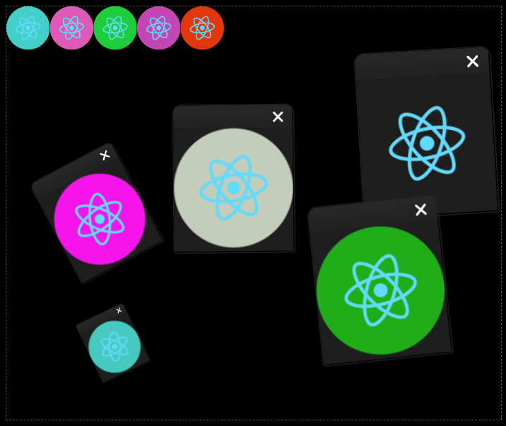

# react-isle

A javascript library leveraging HammerJS' multi-touch gestures to drag, zoom in/out, minimize and maximize React components (*isles*).

Let your isles be free and errant on the screen OR contain and gather them together. How would you call a group of isles? Exact: an **archipelago**! Isles in an archipelago can be minimized and stacked!



## Installation

```bash
npm i react-isle
```

## Usage

```javascript
import Isle, { Archipelago } from "react-isle";

export default function App() {
  return(
    <>
      <Archipelago>
        <Isle className="my-isle" onMaximize={() => alert("Maxi")}>
          <h1>Isle 1</h1>
        </Isle>

        <Isle hideFrame params={{ scale: 0.5, x: 300 }}>
          <h1>Isle 2</h1>
        </Isle>

        <Isle title="Contained Framed Isle">
          <h1>Isle 3</h1>
        </Isle>
      </Archipelago>
			
      <Isle title="Errant Isle">
        <h1>Errant Isle</h1>
      </Isle>
	</>);
}
```

## Contributing
Pull requests are welcome. For major changes, please open an issue first to discuss what you would like to change.

## License
[MIT](https://choosealicense.com/licenses/mit/)